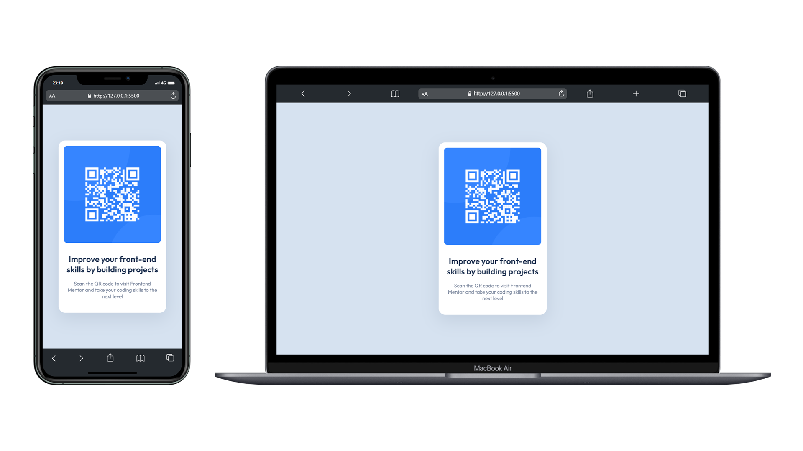

# ✅ Frontend Mentor: QR code component solution

Hello everyone! 🤩

🚶‍♂️ I just tackled the [QR code component challenge on Frontend Mentor](https://www.frontendmentor.io/challenges/qr-code-component-iux_sIO_H)! Those challenges are awesome for leveling up your coding skills by working on real-world projects.

## 🗿 Overview

### 📷 Screenshots



In the image above you can see both the desktop version and the mobile version of the solution. I'm working on creating a new README.md file and I hope this section will look good on GitHub.

### 🔗 Links

- CodeSandbox URL: [https://yclfvn.csb.app](https://yclfvn.csb.app)
- Live Site URL: [https://yavuzkarakus.github.io/frontendMentorQrCode](https://yavuzkarakus.github.io/frontendMentorQrCode/)

## 🚀 My process

### ⚡ Built with

- Semantic HTML5 markup
- CSS custom properties
- Flexbox
- Mobile-first workflow

### 👾 What I learned

First of all, it was exciting to make projects close to real world projects. With this work, I better understood the CSS Flexbox structure and at the same time I strengthened my use of CSS by using the :root structure. On the other hand, I reinforced the use of semantic elements.

HTML Code Snippets:

```html
<!DOCTYPE html>
<html lang="en">
  <head>
    <meta charset="UTF-8" />
    <meta name="viewport" content="width=device-width, initial-scale=1.0" />
    <link
      rel="icon"
      type="image/png"
      sizes="32x32"
      href="./images/favicon-32x32.png"
    />
    <link rel="stylesheet" href="./style/main.css" />
    <title>Frontend Mentor | QR code component</title>
  </head>

  <body>
    <div class="container">
      <header>
        
      </header>
      <main>
        <h2>Improve your front-end skills by building projects</h2>
        <p>
          Scan the QR code to visit Frontend Mentor and take your coding skills
          to the next level
        </p>
      </main>
    </div>
  </body>
</html>
```

CSS Code Snippets:

```css
@import url(variables.css);

* {
  margin: 0;
  padding: 0;
  box-sizing: border-box;
}

body {
  background: var(--theme-color-light-gray);
  width: 100vw;
  height: 100vh;
  display: flex;
  justify-content: center;
  align-items: center;
}

.container {
  background: var(--theme-color-white);
  text-align: center;
  width: 20rem;
  height: auto;
  padding: 1rem;
  border-radius: 1rem;
  box-shadow: 0px 16px 50px 4px hsla(218, 44%, 22%, 0.1);
}

header img {
  width: 100%;
  height: 100%;
  margin-bottom: 1rem;
  border-radius: 0.5rem;
}

main {
  padding: 0.8rem;
}

main h2 {
  color: var(--theme-color-dark-blue);
  margin-bottom: 1rem;
  font-size: 1.4rem;
}

main p {
  font-size: var(--theme-font-size);
  color: var(--theme-color-grayish-blue);
  margin-bottom: 0.6rem;
}

@media screen and (max-width: 375px) {
  .container {
    margin: auto 1.2rem;
  }
}
```

### 💪 Continued development

For front-end developers, the learning process never ends. For this reason, I want to improve myself as much as possible in HTML and CSS. Then I want to complete my development with JS and React.js, discover new CSS libraries and improve myself in every aspect of the field as much as possible.

## 🚩 Author

- Frontend Mentor - [@yavuzkarakus](https://www.frontendmentor.io/profile/yavuzkarakus)

## 📒 Notes

🚶‍♂️ I plan to continue these challenges as long as I can. If you are interested in these topics, don't forget to tune in and follow me.

⭐ If you liked this project and the challenge, please don't forget to star it.
